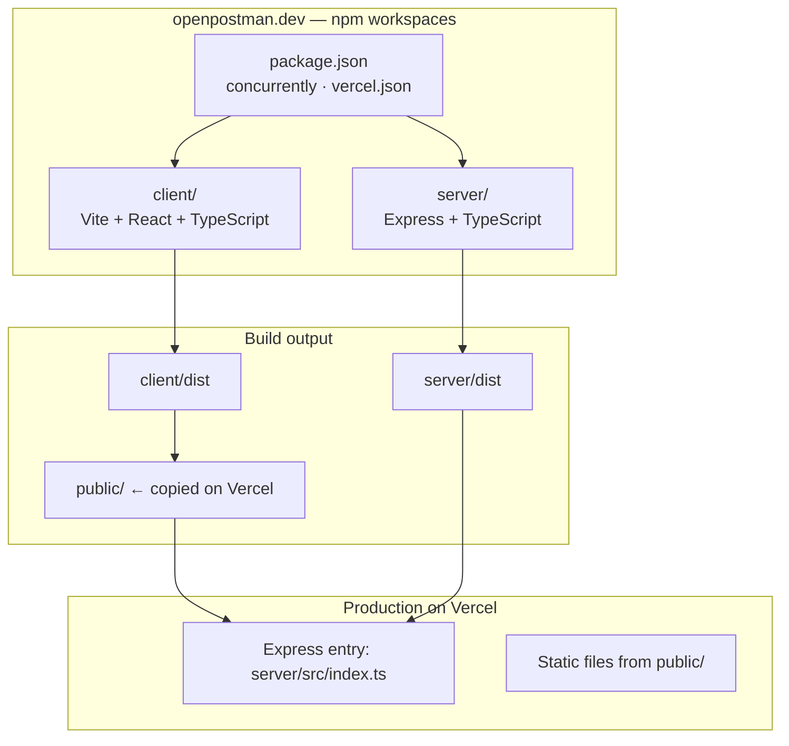
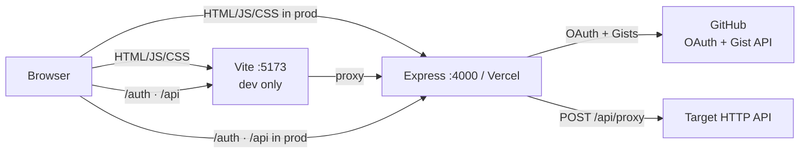
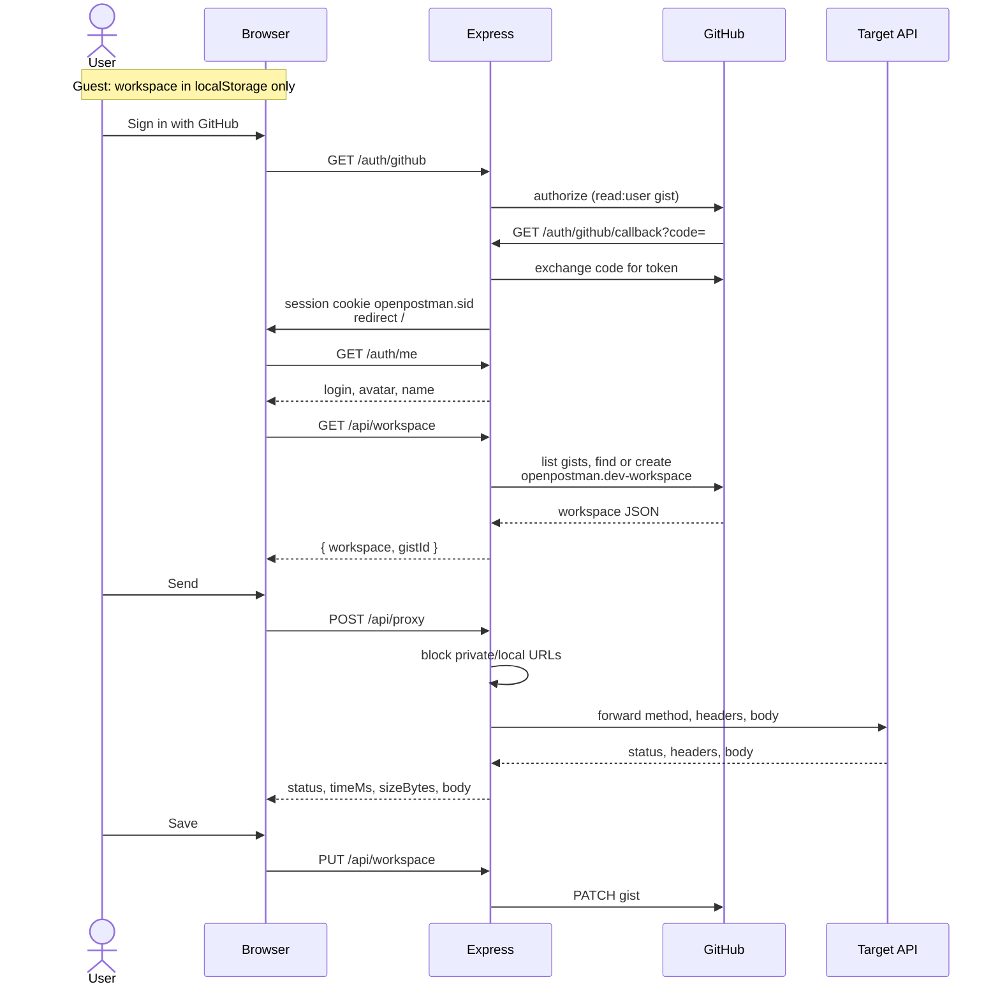
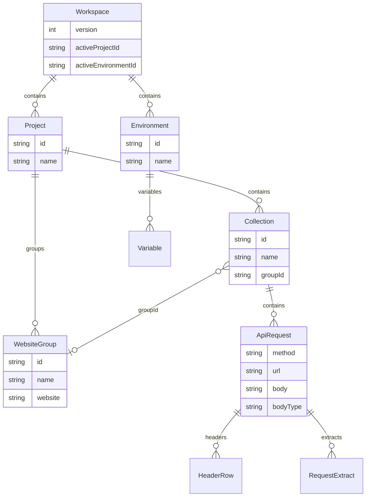
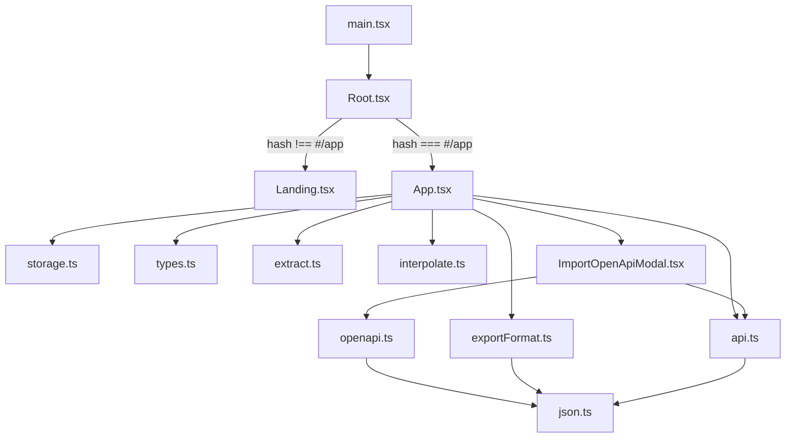
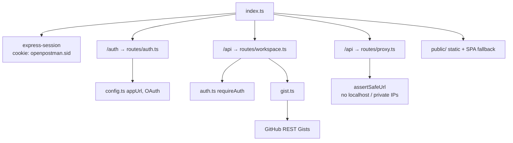
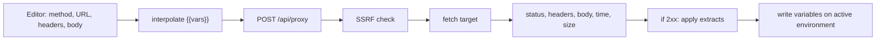
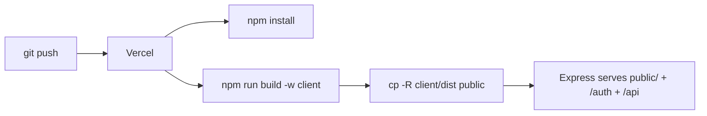

# OpenPostman

[Live site](https://openpostman.dev) · [Source](https://github.com/tiagoyamashita/openpostman.dev) · Apache 2.0

A **free, open-source API client** that runs in the browser. Import an OpenAPI or Swagger spec to read an API, send real HTTP requests to test it, and keep the collection library in **your** GitHub account as a private Gist. There is no OpenPostman database and no paid tier.

Guest mode works with no account: collections stay in this browser’s `localStorage`. Sign in with GitHub only if you want sync and sharing.

## Table of contents

- [What you can do](#what-you-can-do)
- [How the project is put together](#how-the-project-is-put-together)
- [Runtime architecture](#runtime-architecture)
- [Pages and routes](#pages-and-routes)
- [Data model](#data-model)
- [Client modules](#client-modules)
- [Server routes](#server-routes)
- [Auth and storage](#auth-and-storage)
- [Sending a request](#sending-a-request)
- [OpenAPI import](#openapi-import)
- [Export and load](#export-and-load)
- [Setup](#setup)
- [Scripts](#scripts)
- [Deploy (Vercel)](#deploy-vercel)
- [Search](#search)
- [License](#license)

## What you can do

- Send GET / POST / PUT / PATCH / DELETE / HEAD / OPTIONS through a small CORS proxy
- Organize work as **projects → website groups → collections → requests**
- Switch **environments** and interpolate `{{variables}}` in URLs, headers, and bodies
- **Extract** values from a response body or header into environment variables for the next request
- Import **OpenAPI 3.x** and **Swagger 2.0** (paste, file, or URL)
- Export / load the workspace, a collection, or a single request as JSON
- Share one library by collaborating on the private Gist (scopes: `read:user` and `gist` only)

## How the project is put together

npm workspaces at the repo root. Vite builds a static React app; Express holds the session, talks to GitHub, and proxies outbound HTTP. Vercel treats the repo as an Express app and copies the Vite `dist` into `public/` for the CDN.



```text
openpostman.dev
├── client/                 Vite app (landing + workspace)
│   ├── public/            logo, robots.txt, sitemap.xml, manifest
│   └── src/
│       ├── main.tsx       React mount
│       ├── Root.tsx       `/` vs `/#/app`
│       ├── Landing.tsx   marketing page
│       ├── App.tsx        request workspace (god module)
│       ├── api.ts         /auth and /api fetch helpers
│       ├── types.ts       Workspace model + empty/normalize helpers
│       ├── storage.ts     localStorage guest persistence
│       ├── exportFormat.ts JSON export/load
│       ├── openapi.ts     spec → collection
│       ├── extract.ts     response → environment variables
│       └── interpolate.ts {{var}} substitution
├── server/
│   └── src/
│       ├── index.ts       Express app, session, static, catch-all
│       ├── config.ts      env + OAuth callback + app URL
│       ├── auth.ts        requireAuth
│       ├── gist.ts        find/create/update workspace Gist
│       ├── types.ts       shared Workspace + Gist filenames
│       └── routes/        auth, workspace, proxy
├── vercel.json
└── package.json           workspaces: client, server
```

## Runtime architecture

In development, Vite (`:5173`) proxies `/auth` and `/api` to Express (`:4000`). In production, Express serves the built client and those same paths.





## Pages and routes

| URL | What it is |
|-----|------------|
| `/` | Landing page (indexed). What OpenPostman is, how sharing over GitHub works, FAQ. |
| `/#/app` | Request workspace. GitHub OAuth returns here. `noindex`. |
| `/auth/github` | Start OAuth |
| `/auth/github/callback` | Token exchange, set session, redirect to `/#/app` |
| `/auth/me` | Current session user |
| `POST /auth/logout` | Destroy session |
| `GET /api/workspace` | Load or create the private Gist (auth required) |
| `PUT /api/workspace` | Save workspace JSON to that Gist |
| `POST /api/proxy` | Forward an HTTP request (no auth required; SSRF guards apply) |
| `GET /api/health` | `{ ok: true, name: "OpenPostman" }` |

`Root` watches `window.location.hash`: `#/app` renders `App`, anything else renders `Landing`.

## Data model

One JSON document is the whole library. Guest copies live in `localStorage`; signed-in copies live in a private Gist.



`{{variable}}` in a request is replaced from the active environment before send. Extracts write back into that environment after a successful response.

## Client modules

`App` is the hotspot: it owns selection, save/dirty, send, import, and the sidebar. Supporting files stay focused.



## Server routes



## Auth and storage

| Mode | Where the workspace lives |
|------|--------------------------|
| Guest | `localStorage` key `openpostman.dev-workspace` |
| Signed in | Private Gist description `openpostman.dev-workspace`, file `openpostman.dev-workspace.json` |

Older names are still **read** and migrated on the next save:

| Kind | Current | Also accepted |
|------|---------|----------------|
| localStorage | `openpostman.dev-workspace` | `openpostman-workspace`, `openputman-workspace` |
| Gist description / file | `openpostman.dev-workspace(.json)` | `openpostman-workspace`, `openputman-workspace` |
| Export `format` | `openpostman.dev` | `openpostman`, `openputman` |

Session cookie name: `openpostman.sid`. Changing it signs everyone out once.

OAuth scopes: `read:user`, `gist`. No repository access.

## Sending a request



The proxy allows only `http:` / `https:`, blocks localhost, `.local`, cloud metadata hosts, and any DNS result that lands on a private or loopback address. Body cap is 2 MB; timeout is 30 seconds.

## OpenAPI import

`ImportOpenApiModal` takes paste, a file, or a URL (URL fetch goes through `/api/proxy`). `parseOpenApiDocument` in `openapi.ts` builds a collection named from `info.title`, one request per path operation, with method, URL, sample headers, and body when the spec has them.

## Export and load

| Control | Result |
|---------|--------|
| **Export all** | Full workspace JSON (`format: "openpostman.dev"`) |
| **Export request** | Current request only |
| **Load** | Workspace replaces (with new ids); collection or request is merged into the active project |

## Setup

1. Optional — create a [GitHub OAuth App](https://github.com/settings/developers) for Gist sync:
   - **Homepage URL:** `http://localhost:5173`
   - **Authorization callback URL:** `http://localhost:4000/auth/github/callback`
2. Copy env and fill values if you want sign-in:

```bash
cp .env.example .env
```

| Variable | Local default / notes |
|----------|------------------------|
| `PORT` | `4000` |
| `CLIENT_ORIGIN` | `http://localhost:5173` |
| `GITHUB_CALLBACK_URL` | `http://localhost:4000/auth/github/callback` |
| `SESSION_SECRET` | required in production |
| `GITHUB_CLIENT_ID` / `GITHUB_CLIENT_SECRET` | optional; OAuth fails until set |

3. Install and run:

```bash
npm install
npm run dev
```

- UI: http://localhost:5173  
- API: http://localhost:4000  

Guest mode works without OAuth. **Send** still uses the local proxy.

## Scripts

| Command | What it does |
|---------|----------------|
| `npm run dev` | Client + server together |
| `npm run build` | `tsc` + Vite build, then server `tsc` |
| `npm start` | Run the compiled server |

## Deploy (Vercel)

Root `package.json` `main` is `server/src/index.ts`. `vercel.json` builds the client and copies `client/dist` → `public/`.



Set in the Vercel project:

| Variable | Notes |
|----------|--------|
| `SESSION_SECRET` | Required |
| `GITHUB_CLIENT_ID` / `GITHUB_CLIENT_SECRET` | Optional; needed for Gist sync |
| `CLIENT_ORIGIN` | Optional; defaults to the Vercel URL |
| `GITHUB_CALLBACK_URL` | Optional; defaults to `https://<vercel-url>/auth/github/callback` |

Point the GitHub OAuth App homepage and callback at `https://openpostman.dev` when enabling production sign-in.

## Search

`client/public/robots.txt` and `sitemap.xml` ship with the static build.

- Sitemap: https://openpostman.dev/sitemap.xml  
- Submit it in [Google Search Console](https://search.google.com/search-console/sitemaps) and [Bing Webmaster Tools](https://www.bing.com/webmasters/sitemaps)

## License

[Apache License 2.0](LICENSE)
